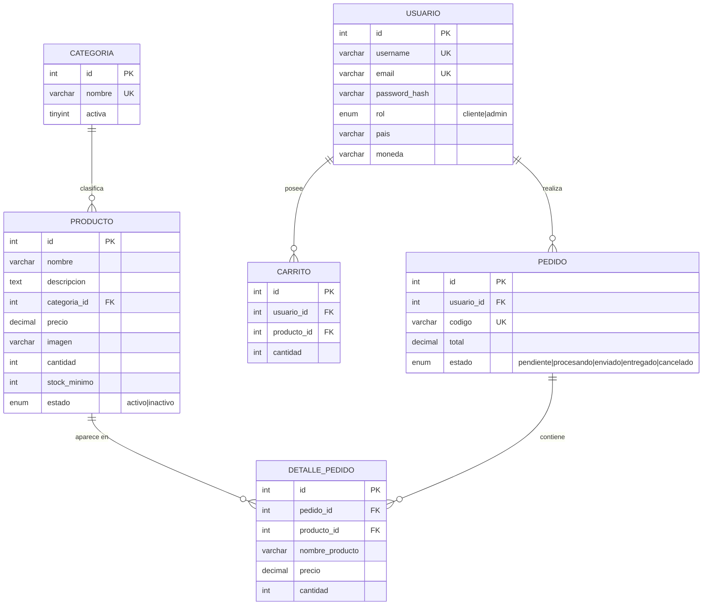

# Diagrama Entidad–Relación - PixelVault

Base de datos: `pixelvault` (MySQL / MariaDB)

## Diagrama (Mermaid)



## Diagrama en texto (legible)

```
USUARIO ──<realiza>── PEDIDO
    id (PK)               id (PK)
    username (UK)         usuario_id (FK -> usuario.id)
    email (UK)            codigo (UK)
    password_hash         total
    rol                   estado
    pais
    moneda

USUARIO ──<posee>── CARRITO
                          id (PK)
                          usuario_id (FK -> usuario.id)
                          producto_id (FK -> producto.id)
                          cantidad

CATEGORIA ──<clasifica>── PRODUCTO
    id (PK)               id (PK)
    nombre (UK)           nombre
    activa                descripcion
                          categoria_id (FK -> categoria.id)
                          precio
                          imagen
                          cantidad
                          stock_minimo
                          estado

PEDIDO ──<contiene>── DETALLE_PEDIDO
                          id (PK)
                          pedido_id (FK -> pedido.id)
                          producto_id (FK -> producto.id)
                          nombre_producto
                          precio
                          cantidad
```

## Tabla de relaciones (claves primarias y foráneas)

| Entidad origen | Relación | Entidad destino | Clave foránea | Cardinalidad |
|---|---|---|---|---|
| CATEGORIA | clasifica | PRODUCTO | `producto.categoria_id → categoria.id` | 1 : N |
| USUARIO | realiza | PEDIDO | `pedido.usuario_id → usuario.id` | 1 : N |
| PEDIDO | contiene | DETALLE_PEDIDO | `detalle_pedido.pedido_id → pedido.id` | 1 : N |
| PRODUCTO | aparece en | DETALLE_PEDIDO | `detalle_pedido.producto_id → producto.id` | 1 : N |
| USUARIO | posee | CARRITO | `carrito.usuario_id → usuario.id` | 1 : N |
| PRODUCTO | en carrito | CARRITO | `carrito.producto_id → producto.id` | 1 : N |

## Notas
- Cada tabla tiene **clave primaria** (`id`, autoincremental).
- Las **claves foráneas** garantizan la integridad referencial (`ON UPDATE CASCADE`, `ON DELETE RESTRICT`/`CASCADE` según el caso).
- `DETALLE_PEDIDO` guarda una copia del nombre y precio del producto al momento de la compra (historial inmutable aun si cambia el catálogo).
- El esquema completo con las sentencias `CREATE TABLE` está en `database/pixelvault.sql`.
